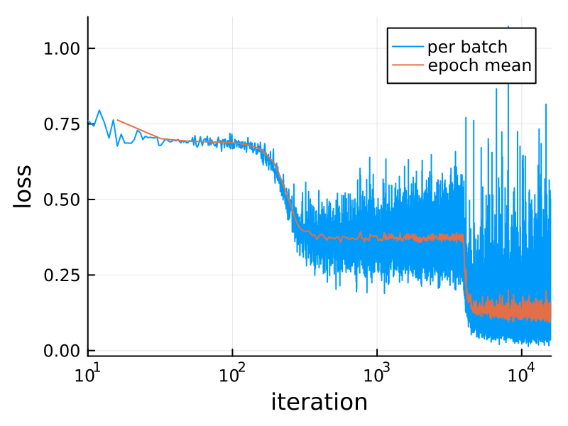

# [A Neural Network in One Minute](@id man-quickstart)

If you have used neural networks before, then this simple example might be helpful for seeing how the major parts of Flux work together. Try pasting the code into the REPL prompt.

If you haven't, then you might prefer the [Fitting a Straight Line](overview.md) page.

```julia
# Install everything, including CUDA, and load packages:
using Pkg; Pkg.add(["Flux", "CUDA", "cuDNN", "ProgressMeter"])
using Flux, CUDA, Statistics, ProgressMeter
device = gpu_device()  # function to move data and model to the GPU

# Generate some data for the XOR problem: vectors of length 2, as columns of a matrix:
noisy = rand(Float32, 2, 1000)                                    # 2×1000 Matrix{Float32}
truth = [xor(col[1]>0.5, col[2]>0.5) for col in eachcol(noisy)]   # 1000-element Vector{Bool}

# Define our model, a multi-layer perceptron with one hidden layer of size 3:
model = Chain(
    Dense(2 => 3, tanh),      # activation function inside layer
    BatchNorm(3),
    Dense(3 => 2)) |> device  # move model to GPU, if one is available

# The model encapsulates parameters, randomly initialised. Its initial output is:
out1 = model(noisy |> device) |> cpu     # 2×1000 Matrix{Float32}
probs1 = softmax(out1)                   # normalise to get probabilities

# To train the model, we use batches of 64 samples, and one-hot encoding:
target = Flux.onehotbatch(truth, [true, false])                   # 2×1000 OneHotMatrix
loader = Flux.DataLoader((noisy, target), batchsize=64, shuffle=true);

opt_state = Flux.setup(Flux.Adam(0.01), model)  # will store optimiser momentum, etc.

# Training loop, using the whole data set 1000 times:
losses = []
@showprogress for epoch in 1:1_000
    for xy_cpu in loader
        # Unpack batch of data, and move to GPU:
        x, y = xy_cpu |> device
        loss, grads = Flux.withgradient(model) do m
            # Evaluate model and loss inside gradient context:
            y_hat = m(x)
            Flux.logitcrossentropy(y_hat, y)
        end
        Flux.update!(opt_state, model, grads[1])
        push!(losses, loss)  # logging, outside gradient context
    end
end

opt_state # parameters, momenta and output have all changed

out2 = model(noisy |> device)  |> cpu   # first row is prob. of true, second row p(false)
probs2 = softmax(out2)                  # normalise to get probabilities
mean((probs2[1,:] .> 0.5) .== truth)    # accuracy 94% so far!
```


```julia
using Plots  # to draw the above figure

p_true = scatter(noisy[1,:], noisy[2,:], zcolor=truth, title="True classification", legend=false)
p_raw =  scatter(noisy[1,:], noisy[2,:], zcolor=probs1[1,:], title="Untrained network", label="", clims=(0,1))
p_done = scatter(noisy[1,:], noisy[2,:], zcolor=probs2[1,:], title="Trained network", legend=false)

plot(p_true, p_raw, p_done, layout=(1,3), size=(1000,330))
```

```@raw html

```

Here's the loss during training:

```julia
plot(losses; xaxis=(:log10, "iteration"),
    yaxis="loss", label="per batch")
n = length(loader)
plot!(n:n:length(losses), mean.(Iterators.partition(losses, n)),
    label="epoch mean", dpi=200)
```

This XOR ("exclusive or") problem is a variant of the famous one which drove Minsky and Papert to invent deep neural networks in 1969. For small values of "deep" -- this has one hidden layer, while earlier perceptrons had none. (What they call a hidden layer, Flux calls the output of the first layer, `model[1](noisy)`.)

Since then things have developed a little. 

## Features to Note

Some things to notice in this example are:

* The batch dimension of data is always the last one. Thus a `2×1000 Matrix` is a thousand observations, each a column of length 2. Flux defaults to `Float32`, but most of Julia to `Float64`.

* The `model` can be called like a function, `y = model(x)`. Each layer like [`Dense`](@ref Flux.Dense) is an ordinary `struct`, which encapsulates some arrays of parameters (and possibly other state, as for [`BatchNorm`](@ref Flux.BatchNorm)).

* But the model does not contain the loss function, nor the optimisation rule. The momenta needed by [`Adam`](@ref Optimisers.Adam) are stored in the object returned by [setup](@ref Flux.Train.setup). And [`Flux.logitcrossentropy`](@ref Flux.Losses.logitcrossentropy) is an ordinary function that combines the [`softmax`](@ref Flux.softmax) and [`crossentropy`](@ref Flux.crossentropy) functions.

* The `do` block creates an anonymous function, as the first argument of `gradient`. Anything executed within this is differentiated.

Instead of calling [`gradient`](@ref Zygote.gradient) and [`update!`](@ref Flux.update!) separately, there is a convenience function [`train!`](@ref Flux.train!). If we didn't want anything extra (like logging the loss), we could replace the training loop with the following:

```julia
for epoch in 1:1_000
    Flux.train!(model, loader |> device, opt_state) do m, x, y
        y_hat = m(x)
        Flux.logitcrossentropy(y_hat, y)
    end
end
```

* In our simple example, we conveniently created the model has a [`Chain`](@ref Flux.Chain) of layers. 
For more complex models, you can define a custom struct `MyModel` containing layers and arrays and implement the call operator `(::MyModel)(x) = ...` to define the forward pass. This is all it is needed for Flux to work. Marking the struct with [`Flux.@layer`](@ref) will add some more functionality, like pretty printing and the ability to mark some internal fields as trainable or not (also see [`trainable`](@ref Optimisers.trainable)).
