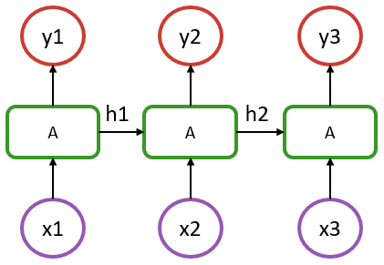

# Recurrent Models

## Recurrent cells

To introduce Flux's recurrence functionalities, we will consider the following vanilla recurrent neural network structure:



In the above, we have a sequence of length 3, where `x1` to `x3` represent the input at each step. It could be a timestamp or a word in a sentence encoded as vectors. `y1` to `y3` are their respective outputs.

An aspect to recognise is that in such a model, the recurrent cells `A` all refer to the same structure. What distinguishes it from a simple dense layer is that the cell `A` is fed, in addition to an input `x`, with information from the previous state of the model (hidden state denoted as `h1` & `h2` in the diagram).

In the most basic RNN case, cell A could be defined by the following: 

```julia
output_size = 5
input_size = 2
Wxh = randn(Float32, output_size, input_size)
Whh = randn(Float32, output_size, output_size)
b = zeros(Float32, output_size)

function rnn_cell(x, h)
    h = tanh.(Wxh * x .+ Whh * h .+ b)
    return h, h
end

seq_len = 3
# dummy input data
x = [rand(Float32, input_size) for i = 1:seq_len] 
# random initial hidden state
h0 = zeros(Float32, output_size) 

y = []
ht = h0
for xt in x
    yt, ht = rnn_cell(xt, ht)
    y = [y; [yt]]  # concatenate in non-mutating (AD friendly) way
end
```

Notice how the above is essentially a `Dense` layer that acts on two inputs, `xt` and `ht`.
The result of the forward pass at each time step, is a tuple contening the output `yt` and the updated state `ht`. The updated state is used as an input in next iteration. In the simple case of a vanilla RNN, the 
output and the state are the same. In more complex cells, such as `LSTMCell`, the state can contain multiple arrays.

There are various recurrent cells available in Flux, notably `RNNCell`, `LSTMCell` and `GRUCell`, which are documented in the [layer reference](../../reference/models/layers.md). The hand-written example above can be replaced with:

```julia
using Flux

output_size = 5
input_size = 2
seq_len = 3
x = [rand(Float32, input_size) for i = 1:seq_len] 
h0 = zeros(Float32, output_size) 

rnn_cell = Flux.RNNCell(input_size => output_size)

y = []
ht = h0
for xt in x
    yt, ht = rnn_cell(xt, ht)
    y = [y; [yt]]
end
```
The entire output `y` or just the last output `y[end]` can be used for further processing, such as classification or regression. 

## Using a cell as part of a model

Let's consider a simple model that is trained to predict a scalar quantity for each time step in a sequence. The model will have a single RNN cell, followed by a dense layer to produce the output.
Since the [`RNNCell`](@ref) can deal with batches of data, we can define the model to accept an input where
at each time step, the input is a matrix of size `(input_size, batch_size)`. 

```julia
struct RecurrentCellModel{H,C,D}
    h0::H
    cell::C
    dense::D
end

# we choose to not train the initial hidden state
Flux.@layer RecurrentCellModel trainable=(cell, dense) 

function RecurrentCellModel(input_size::Int, hidden_size::Int)
    return RecurrentCellModel(
                 zeros(Float32, hidden_size), 
                 RNNCell(input_size => hidden_size),
                 Dense(hidden_size => 1))
end

function (m::RecurrentCellModel)(x)
    z = []
    ht = m.h0
    for xt in x
        yt, ht = m.cell(xt, ht)
        z = [z; [yt]]
    end
    z = stack(z, dims=2) # [hidden_size, seq_len, batch_size] or [hidden_size, seq_len]
    ŷ = m.dense(z)       # [1, seq_len, batch_size] or [1, seq_len]
    return ŷ
end
```

Notice that we stack the hidden states `z` to form a tensor of size `(hidden_size, seq_len, batch_size)`. This can speedup the final classification, since we then process all the outputs at once with a single forward pass of the dense layer. 

Let's now define the training loop for this model:

```julia
using Optimisers: AdamW

function loss(model, x, y)
    ŷ = model(x)
    return Flux.mse(ŷ, y)
end

# create dummy data
seq_len, batch_size, input_size = 3, 4, 2
x = [rand(Float32, input_size, batch_size) for _ = 1:seq_len]
y = [rand(Float32, 1, batch_size) for _ = 1:seq_len]

# initialize the model and optimizer
model = RecurrentCellModel(input_size, 5)
opt_state = Flux.setup(AdamW(1e-3), model)

# compute the gradient and update the model
g = gradient(m -> loss(m, x, y), model)[1]
Flux.update!(opt_state, model, g)
```

## Handling the whole sequence at once

In the above example, we processed the sequence one time step at a time using a recurrent cell. However, it is possible to process the entire sequence at once. This can be done by stacking the input data `x` to form a tensor of size `(input_size, seq_len)` or `(input_size, seq_len, batch_size)`. 
One can then use the [`RNN`](@ref), [`LSTM`](@ref) or [`GRU`](@ref) layers to process the entire input tensor. 

Let's consider the same example as above, but this time we use an `RNN` layer instead of an `RNNCell`:

```julia
struct RecurrentModel{H,C,D}
    h0::H
    rnn::C
    dense::D
end

Flux.@layer RecurrentModel trainable=(rnn, dense)

function RecurrentModel(input_size::Int, hidden_size::Int)
    return RecurrentModel(
                 zeros(Float32, hidden_size), 
                 RNN(input_size => hidden_size),
                 Dense(hidden_size => 1))
end

function (m::RecurrentModel)(x)
    z = m.rnn(x, m.h0)  # [hidden_size, seq_len, batch_size] or [hidden_size, seq_len]
    ŷ = m.dense(z)      # [1, seq_len, batch_size] or [1, seq_len]
    return ŷ
end

seq_len, batch_size, input_size = 3, 4, 2
x = rand(Float32, input_size, seq_len, batch_size)
y = rand(Float32, 1, seq_len, batch_size)

model = RecurrentModel(input_size, 5)
opt_state = Flux.setup(AdamW(1e-3), model)

g = gradient(m -> Flux.mse(m(x), y), model)[1]
Flux.update!(opt_state, model, g)
```

Finally, the [`Recurrence`](@ref) layer can be used wrap any recurrent cell to process the entire sequence at once. For instance, a type behaving the same as the `LSTM` layer can be defined as follows:

```julia
rnn = Recurrence(LSTMCell(2 => 3))   # similar to LSTM(2 => 3)
x = rand(Float32, 2, 4, 3)
y = rnn(x)
```

## Stacking recurrent layers

Recurrent layers can be stacked to form a deeper model by simply chaining them together using the [`Chain`](@ref) layer. The output of a layer is fed as input to the next layer in the chain.
For instance, a model with two LSTM layers can be defined as follows:

```julia
stacked_rnn = Chain(LSTM(3 => 5), Dropout(0.5), LSTM(5 => 5))
x = rand(Float32, 3, 4)
y = stacked_rnn(x)
```

If more fine grained control is needed, for instance to have a trainable initial hidden state, one can define a custom model as follows: 

```julia
struct StackedRNN{L,S}
    layers::L
    states0::S
end

Flux.@layer StackedRNN

function StackedRNN(d::Int; num_layers::Int)
    layers = [LSTM(d => d) for _ in 1:num_layers]
    states0 = [Flux.initialstates(l) for l in layers]
    return StackedRNN(layers, states0)
end

function (m::StackedRNN)(x)
   for (layer, state0) in zip(rnn.layers, rnn.states0)
       x = layer(x, state0) 
   end
   return x
end

rnn = StackedRNN(3; num_layers=2)
x = rand(Float32, 3, 10)
y = rnn(x)
```
