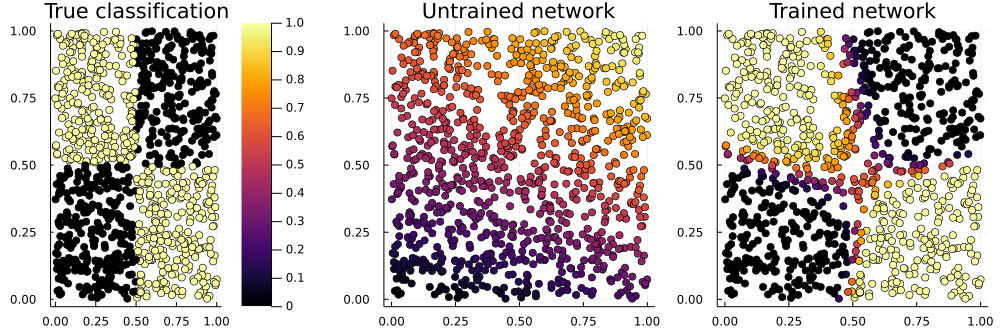

# [A Neural Network in One Minute](@id man-quickstart)

If you have used neural networks before, then this simple example might be helpful for seeing how the major parts of Flux work together. Try pasting the code into the REPL prompt.

If you haven't, then you might prefer the [Fitting a Straight Line](overview.md) page.

```julia
# With Julia 1.7+, this will prompt if neccessary to install everything, including CUDA:
using Flux, Statistics

# Generate some data for the XOR problem: vectors of length 2, as columns of a matrix:
noisy = rand(Float32, 2, 1000)                                    # 2×1000 Matrix{Float32}
truth = map(col -> xor(col...), eachcol(noisy .> 0.5))            # 1000-element Vector{Bool}

# Define our model, a multi-layer perceptron with one hidden layer of size 3:
model = Chain(Dense(2 => 3, tanh), BatchNorm(3), Dense(3 => 2), softmax)

# The model encapsulates parameters, randomly initialised. Its initial output is:
out1 = model(noisy)                                               # 2×1000 Matrix{Float32}

# To train the model, we use batches of 64 samples, and one-hot encoding:
target = Flux.onehotbatch(truth, [true, false])                   # 2×1000 OneHotMatrix
loader = Flux.DataLoader((noisy, target), batchsize=64, shuffle=true);
first(loader) .|> summary                                         # ("2×64 Matrix{Float32}", "2×64 Matrix{Bool}")

pars = Flux.params(model)  # contains references to arrays in model
opt = Flux.Adam(0.01)      # will store optimiser momentum, etc.

# Training loop, using the whole data set 1000 times:
for epoch in 1:1_000
    losses = []
    for (x, y) in loader
        loss, grad = Flux.withgradient(pars) do
            # Evaluate model and loss inside gradient context:
            y_hat = model(x)
            Flux.crossentropy(y_hat, y)  # could use just sum(abs2, y_hat .- y)
        end
        # Use the gradient to update the model's parameters (and momentum):
        Flux.update!(opt, pars, grad)
        # Logging code, outside gradient context:
        push!(losses, loss)
    end
    if isinteger(log2(epoch))
        println("after epoch $epoch, loss is ", mean(losses))
    end
end

pars  # parameters, momenta and output have all changed
opt
out2 = model(noisy)  # first row is prob. of true, second row p(false)

mean((out2[1,:] .> 0.5) .== truth)  # accuracy 94% so far!
```



```
using Plots  # to draw the above figure

p_true = scatter(noisy[1,:], noisy[2,:], zcolor=truth, title="True classification", legend=false)
p_raw =  scatter(noisy[1,:], noisy[2,:], zcolor=out1[1,:], title="Untrained network", label="", clims=(0,1))
p_done = scatter(noisy[1,:], noisy[2,:], zcolor=out2[1,:], title="Trained network", legend=false)

plot(p_true, p_raw, p_done, layout=(1,3), size=(1000,330))
```

This XOR ("exclusive or") problem is a variant of the famous one which drove Minsky and Papert to invent deep neural networks in 1969. For small values of "deep" -- this has one hidden layer, while earlier perceptrons had none. (What they call a hidden layer, Flux calls the output of the first layer, `model[1](noisy)`.)

Since then things have developed a little. 

## Features of Note

Some things to notice in this example are:

* The batch dimension of data is always the last one. Thus a `2×1000 Matrix` is a thousand observations, each a column of length 2. Flux defaults to `Float32`, but most of Julia to `Float64`.

* The `model` can be called like a function, `y = model(x)`. Each layer like [`Dense`](@ref ) is an ordinary `struct`, which encapsulates some arrays of parameters (and possibly other state, as for [`BatchNorm`](@ref)).

* But the model does not contain the loss function, nor the optimisation rule. The [`Adam`](@ref Flux.Adam) object stores between iterations the momenta it needs. And [`Flux.crossentropy`](@ref Flux.Losses.crossentropy) is an ordinary function.

* Instead of calling [`gradient`](@ref Zygote.gradient) and [`update!`](@ref Flux.update!) separately, there is a convenience function [`train!`](@ref Flux.train!) which we could use. However, to do anything extra (like logging the loss) an explicit loop is usually clearest.
