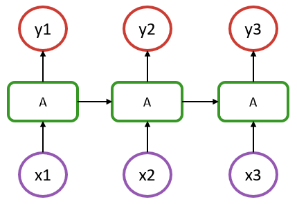

# Recurrent Models

## Recurrent cells

To introduce Flux's recurrence functionalities, we will consider the following vanilla recurrent neural network structure:



In the above, we have a sequence of length 3, where `x1` to `x3` represent the input at each step (could be a timestamp or a word in a sentence), and `y1` to `y3` are their respective outputs.

An aspect to recognize is that in such model, the recurrent cells `A` all refer to the same structure. What distinguishes it from a simple dense layer is that the cell A is fed, in addition to an input `x`, with information from the previous state of the model (hidden state denoted as `h1` & `h2` in the diagram).

In the most basic RNN case, cell A could be defined by the following: 

```julia
Wxh = randn(5, 2)
Whh = randn(5, 5)
b   = randn(5)

function rnn(h, x)
  h = tanh.(Wxh * x .+ Whh * h .+ b)
  return h, h
end

x = rand(2) # dummy data
h = rand(5)  # initial hidden state

h, y = rnn(h, x)
```

Notice how the above is essentially a `Dense` layer that acts on two inputs, `h` and `x`.

If you run the last line a few times, you'll notice the output `y` changing slightly even though the input `x` is the same.

There are various recurrent cells available in Flux, notably `RNNCell`, `LSTMCell` and `GRUCell`, which are documented in the [layer reference](layers.md). The hand-written example above can be replaced with:

```julia
using Flux

rnn = Flux.RNNCell(2, 5)

x = rand(Float32, 2) # dummy data
h = rand(Float32, 5)  # initial hidden state

h, y = rnn(h, x)
```

## Stateful Models

For the most part, we don't want to manage hidden states ourselves, but to treat our models as being stateful. Flux provides the `Recur` wrapper to do this.

```julia
x = rand(Float32, 2)
h = rand(Float32, 5)

m = Flux.Recur(rnn, h)

y = m(x)
```

The `Recur` wrapper stores the state between runs in the `m.state` field.

If we use the `RNN(2, 5)` constructor – as opposed to `RNNCell` – you'll see that it's simply a wrapped cell.

```julia
julia> RNN(2, 5)
Recur(RNNCell(2, 5, tanh))
```

Equivalent to the `RNN` stateful constructor, `LSTM` and `GRU` are also available. 

Using these tools, we can now build the model is the above diagram with: 

```julia
m = Chain(RNN(2, 5), Dense(5, 1), x -> reshape(x, :))
```

## Working with sequences

Using the previously defined `m` recurrent model, we can the apply it to a single step from our sequence:

```julia
x = rand(Float32, 2)
julia> m(x)
1-element Array{Float32,1}:
 0.028398542
```

The m(x) operation would be represented by `x1 -> A -> y1` in our diagram.
If we perform this operation a second time, it will be equivalent to `x2 -> A -> y2` since the model `m` has stored the state resulting from the `x1` step:

```julia
x = rand(Float32, 2)
julia> m(x)
1-element Array{Float32,1}:
 0.07381232
```

Now, instead of computing a single step at a time, we can get the full `y1` to `y3` sequence in a single pass by broadcasting the model on a sequence of data. 

To do so, we'll need to structure the input data as a `Vector` of observations at each time step. This `Vector` will therefore be of length = `seq_length` and each of its elements will represent the input features for a given step. In our example, this translates into a `Vector` of length 3, where each element is a `Matrix` of size `(features, batch_size)`, or just a `Vector` of length `features` if dealing with a single observation.  

```julia
x = [rand(Float32, 2) for i = 1:3]
julia> m.(x)
3-element Array{Array{Float32,1},1}:
 [-0.17945863]
 [-0.20863166]
 [-0.20693761]
```

If for some reason one wants to exclude the first step of the RNN chain for the computation of the loss, that can be handled with:

```julia
function loss(x, y)
  sum((Flux.stack(m.(x)[2:end],1) .- y) .^ 2)
end

y = rand(Float32, 2)
julia> loss(x, y)
1.7021208968648693
```

In such model, only `y2` and `y3` are used to compute the loss, hence the target `y` being of length 2. This is a strategy that can be used to easily handle a `seq-to-one` kind of structure, compared to the `seq-to-seq` assumed so far.   

Alternatively, if one wants to perform some warmup of the sequence, it could be performed once, followed with a regular training where all the steps of the sequence would be considered for the gradient update:

```julia
function loss(x, y)
  sum((Flux.stack(m.(x),1) .- y) .^ 2)
end

seq_init = [rand(Float32, 2) for i = 1:1]
seq_1 = [rand(Float32, 2) for i = 1:3]
seq_2 = [rand(Float32, 2) for i = 1:3]

y1 = rand(Float32, 3)
y2 = rand(Float32, 3)

X = [seq_1, seq_2]
Y = [y1, y2]
data = zip(X,Y)

Flux.reset!(m)
m.(seq_init)

ps = params(m)
opt= ADAM(1e-3)
Flux.train!(loss, ps, data, opt)
```

In this previous example, model's state is first reset with `Flux.reset!`. Then, there's a warmup that is performed over a sequence of length 1 by feeding it with `seq_init`, resulting in a warmup state. The model can then be trained for 1 epoch, where 2 batches are provided (`seq_1` and `seq_2`) and all the timesteps outputs are considered for the loss (we no longer use a subset of `m.(x)` in the loss function).

In this scenario, it is important to note that a single continuous sequence is considered. Since the model state is not reset between the 2 batches, the state of the model flows through the batches, which only makes sense in the context where `seq_1` is the continuation of `seq_init` and so on.

Batch size would be 1 here as there's only a single sequence within each batch. If the model was to be trained on multiple independent sequences, then these sequences could be added to the input data as a second dimension. For example, in a language model, each batch would contain multiple independent sentences. In such scenario, if we set the batch size to 4, a single batch would be of the shape:

```julia
batch = [rand(Float32, 2, 4) for i = 1:3]
```

That would mean that we have 4 sentences (or samples), each with 2 features (let's say a very small embedding!) and each with a length of 3 (3 words per sentence). Computing `m(batch[1])`, would still represent `x1 -> y1` in our diagram and returns the first word output, but now for each of the 4 independent sentences (second dimension of the input matrix).

In many situations, such as when dealing with a language model, each batch typically contains independent sentences, so we cannot handle the model as if each batch was the direct continuation of the previous one. To handle such situation, we need to reset the state of the model between each batch, which can be conveniently performed within the loss function:

```julia
function loss(x, y)
  Flux.reset!(m)
  sum((Flux.stack(m.(x),1) .- y) .^ 2)
end
```

A potential source of ambiguity of RNN in Flux can come from the different data layout compared to some common frameworks where data is typically a 3 dimensional array: `(features, seq length, samples)`. In Flux, those 3 dimensions are provided through a vector of seq length containing a matrix `(features, samples)`.
